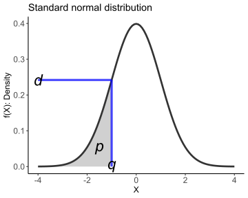

```{r setup, include=FALSE}
knitr::opts_chunk$set(echo = TRUE)
```

# Fundamental

## Version and setting

First for all
```{r}
sessionInfo()
```

設置成 UTF-8
- Tools > Global Options > Code > Saving > Default text encoding > UTF-8


## Rstudio environment

- Four panels
  + Script
  + Console
  + Environment, History, Connections, Tuttorial
  + Files, Plots, Packages, Help, Viewer
- R project
- Rmd
  + Reference: https://rmarkdown.rstudio.com/lesson-1.html
  + Knit
  + Code chunk: (Mac) command+option+i / (Win) ctrl+alt+i

## Data structure

Vector
- Atomic vector
  + Logical
  + Integer (factor, date) \in numeric(number)
  + Double (time) \in numeric(number)
  + Character
  + (vector, matrix, array)
- List (data.frame, tibble)

command+option+i / cntl+alt+i

### Atomic vector

#### logical/integer/double/character vector
```{r}
a = c(1L, 2L, 3L) #integer
a
typeof(a)
mode(a)

d = c(3.3, 3.14) # double
d
typeof(d) # vvvv
mode(d) # xxxx

b = c("ha", "you", "hello") #charcter
b
typeof(b)

e = c(TRUE, FALSE, T, F)
e
typeof(e)
```

#### matrix / array
```{r}

1:8
c(1, 2, 3, 4, 5,6,7,8)
aMatrix <- matrix(1:8, ncol = 2, byrow = TRUE)
aMatrix

aArray <- array(1:8, dim = c(2,2,2))
aArray
```


#### subvector
```{r}
d <- c(23, 2.5, 3.8, 9)
d
typeof(d)

sum(d)
sd(d)
max(d)
min(d)
summary(d)

d[2]
d[3]

d[c(1, 3)]

aMatrix[2, 1]
aMatrix[1, ]
aMatrix[, 1]
aMatrix[c(2,3), c(1,2)]
aMatrix[6]
aMatrix

```

### List

#### list
```{r}
l = list(3, 3.4, "a", TRUE)
l
typeof(l)

aList = list(a = 1:3, # a = c(1,2,3)
             b = TRUE, 
             c = list(d = "happy", 
                      e = c(1.3, 4.5, 7.83, pi)))
aList

typeof(aList)
class(aList)
```

#### sublist??
```{r}
aList
aList[1]
aList["a"]
aList$a
aList[[1]]
aList[["a"]]

aList$c
aList$c[2]
aList$c[[2]]
aList$c[2][2]
aList$c[[2]][2]
aList$c$e
aList$c$e[2]

aList[3]
aList[[3]]
aList[[3]][2]
#...
```

#### data.frame (2-dim)

- row: observation
- col: variable
```{r}
rep(1.5, times = 6)
rev(11:16)
aDf <- data.frame(a = rep(1.5, times = 6),
                  b = c("a", "b", "c", "d", "e", "f"),
                  c = LETTERS[1:6],
                  d = c(TRUE, FALSE, TRUE, FALSE, T, F),
                  e = rev(11:16))
aDf
typeof(aDf)
class(aDf)
class(aList)


```
#### sub-data.frame
```{r}
# [] 
aDf[1]
aDf["a"]

# [,]
aDf[1, 3]
aDf[c(1, 3), 3:4]

# [[]]
aDf[[3]]
aDf[["c"]]
aDf[[3]][3]

# $
aDf$e
aDf$e[2:3]
```

## How to use help

```{r}
d
sum(d)
help(sum)
# ?sum
# ??sum
```


--------------------------------------------------------------------------------
## 0628_Exercises

1. 如果有空的話可以看一看 Rmarkdown 的介紹 [https://rmarkdown.rstudio.com/lesson-1.html]，或是直接上網搜尋 Rmarkdown 的其他教學。
  
  - 你可以嘗試 knit 這份文件看看？！是否有成功？

2. 理解上方每一條 code 的語法與結果是什麼
  
  - 可以嘗試更改裡頭的元素，如`[1]`改成`[2]`
  - 用 `help()` 查詢每個 function, 如 `help(c)`, `help(sum)`, `help(help)`
  - 你能不能建立屬於自己的例子
  
3. 觀察 atomic vector 與 list 變數跑出來呈現上的差異。

4. 在 sub-list 與 sub-data.frame 的 code chunk 中，分別用了 `[`、`[[` 還有 
`$` 這三種奇怪的符號
  
  - 請你仔細觀察這三個符號使用上的差異，並在下次上課時告數我你發現到什麼。
  - 建議可以搭配 `typeof()` 觀察，例如 `typeof(aList[[3]])`。
 
5. [額外補充] [輕鬆學習R語言](https://yaojenkuo.gitbooks.io/learn-r-the-easy-way/content/chapter2.html)，可以參考裡頭的 Day2-Day7
  
  - 這幾章剛好有提到 R 其他種類的資料型態 (type of) 以及資料結構 (structure) 或正確來說是屬性 (class)
  - 雖然他是寫得淺顯易懂 (而且是中文)，但實際上他將資料結構用維度的方式來進行分類，我不完全同意這種方式(但大部份 R 語言介紹書都是者樣寫)，因為它並沒有把 atomic vector 與 list 做出明顯的區分。
  - 最正確的分類方式：[Advance R: Chapter 3](https://adv-r.hadley.nz/vectors-chap.html)
  - 順帶一題,上面兩本書實際上都是由 Rmarkdown 寫的喔！！！
  
6. 如果你覺得我上課有任何建議，講太簡單、太難、太慢、太快等，都很歡迎留言告訴我，我們可以持續改進找到彼此適合的模式 😁
--------------------------------------------------------------------------------


### assignment, replacment
```{r}
a1 = c(10, 11, 12)
a2 <- c(10, 11, 12)
a4 <- c(10, 20, 30) -> a3

a1
a2
a3
a4

a1 == a2
a2 == a3
a3 == a1

identical(a1, a2)
identical(a1, a3)
```


```{r}
a1[2]
a1[2:3]

a1[c(3, 1)]

a1
a1[c(3, 1)] <- c(100, 300)
a1

a1
a3
a1[c(3, 1)] <- a3[c(2, 3)]
a1

a3
a3 <- rev(a3)
a3
```
```{r}
aVector <- c(a = 1, b = 2, c = 3)
aVector
names(aVector)
names(aVector) <- c("q", "w", "e")
aVector

aVector["a"]
aVector[["a"]]

largerThanTwo <- aVector >= 2
largerThanTwo
aVector[largerThanTwo]
aVector[c(2, 3)]
aVector[c(F, T, T)]
```
```{r}
sum(a1)
sd(a1)
mean(a1)
Mode(a1) ## mode(a1)
median(a1)
max(a1)
```


## Enter data

Enter data according to these variable names   
  
Mc = totality mortality in control (CABG) arm    
Me = totality mortality in experimental (PCI) arm    
Pc = Death, MI, stroke  in control (CABG) arm     
Pe = Death, MI, stroke in experimental (PCI) arm     
Re = MACCE outcome in experimental (PCI) arm (Death, MI, stroke, revascularization)         
Rc = MACCE outcome in control (CABG) arm (Death, MI, stroke, revascularization)          
Nc = Number of subjects in control (CABG) arm    
Ne = Number of subjects in experimental (PCI) arm     

$$
posterior = \frac{prior \times likelihood}{constant} \\
\sum_{i = 1}^n i = \frac{n\times(n+1)}{2}
$$

## package
functions and dataset

dataset
```{r}
iris
mtcars
help(mtcars)
data()

data(package = "CCTpack")
```


```{r results='asis', warning=FALSE, message=FALSE}
# install.packages("")
# indtall.packages(c("", ""))

library(knitr) #kable()
#library(coda)
#library(rjags) 
library(kableExtra)
#library(ggplot2)
library(ggthemes)
library(metafor)
library(meta)
library(tidyverse)

# require(tidyverse)
```


```{r results='asis', warning=FALSE, message=FALSE}
# mortality data entered as NOBLE, SYNTAX,  EXCEL, PRECOMBAT (leave oout these small trials Boudriot) 
# composite endpoint for Noble = sum mortality+Mi+stroke PCI= 54+43+21=118; CABG=50+15+12=77
Mc<-c(23, 50, 48, 89) #event in non-expose (CABG)
Nc<-c(300, 592, 348, 957) #total in non-expose
Me<-c(17, 54, 45, 119) #event in expose (PCI)
Ne<-c(300, 592, 357, 948) #total in expose
Pc<-c(28, 77, 69, 176) #event in non-expose (CABG)
Pe<-c(25, 118, 67, 203) #event in expose (PCI)
Re <- c(52, 165,130,290) #event in expose (PCI) - MACCE includes revasc
Rc <- c(42, 110, 103, 228) #event in non-expose (CABG) - MACCE includes revasc

temp <- data.frame(Mc=Mc,Me=Me,Pc=Pc, Pe=Pe, Rc=Rc, Re=Re, Nc=Nc, Ne=Ne)
temp

tem2 <- data.frame(Mc = c(23, 50, 48, 89),
                   Nc = c(300, 592, 348, 957))

temp
temp[, 3]
temp$Pc

temp[3]
temp["Pc"]

temp$Pc <- temp$Pc * 2 

temp$Study <- c("PRECOMBAT", "NOBLE", "SYNTAX", "EXCEL")
temp

t1 <- temp[9]
t1
t2 <- temp[1:8]
t2
temp2 <- cbind(t1, t2)
temp2
temp
temp3 <- rbind(temp, temp)
temp3

temp <- temp[c(9,1:8)] # reorder columns
temp
```


```{r results='asis', warning=FALSE, message=FALSE}
kable(temp, caption="Outcomes at 5 years") %>%
  kable_styling(bootstrap_options = "striped", full_width = F)

write.csv(temp, file = "data/data1.csv")
```


```{r}
# wroking dir = "C:/Users/Nick Lin/Desktop/Brophy_2020"
getwd()

# absolute path: "C:/Users/...../Brophy_2020/Figure1.rmd"
# relative path: "Figure1.rmd"
```


```{r}
temp2 <- read.csv("data/data1.csv")
temp2 <- read.csv("C:/Users/Nick Lin/Desktop/Brophy_2020/data/data1.csv")
temp2
```


## EXCEL data alone

### Primary outcome difference
Bayesian probability difference based on non-informative prior

```{r}
temp <- data.frame(Mc=Mc,Me=Me,Pc=Pc, Pe=Pe, Rc=Rc, Re=Re, Nc=Nc, Ne=Ne)
temp$Study <- c("PRECOMBAT", "NOBLE", "SYNTAX", "EXCEL")
temp <- temp[c(9,1:8)] # reorder columns
temp

# Excel data
Ex_p_c <- temp[4,4]
Ex_p_e <- temp[4,5]
Ex_n_c <- temp[4,8]
Ex_n_e <- temp[4,9]

paste0("Conirming that hot coded data ", (203/948) - (176/957), "is = to data read from file, ", (Ex_p_e/Ex_n_e) - (Ex_p_c/Ex_n_c))
```

### Paste 的用法

```{r}
paste("a", "b") # 之間會多空格，因為 sep = " "
paste0("a", "b") # 等同於 paste("a", "b", sep = "")
paste("a", "b", sep = "/")
```


## Distribution in R 

### Four types of functions

- *d*：機率質量/密度函數 (mass / density)  
- *p*：累積機率函數 (probability)  
- *q*：反累積機率函數 (quantile)  
- *r*：根據某機率分配，隨機 (random)產生之數值 

### Example 1: Normal Distribution

  * R預設是$\mu=0,\sigma=1$的常態分配，即標準常態分配 (standard normal distribution)
  1. `dnorm(x, mean = 0, sd = 1, log = F)`：計算$f(x)=\frac{1}{\sigma\sqrt{2\pi}}e^{-\frac{(x-\mu)^2}{2\sigma^2}},x \in \mathbb{R}$
  2. `pnorm(x, mean = 0, sd = 1, lower.tail = T, log.p = F)`：計算$F_X(x) =  \int_{-\infty}^x \frac{1}{\sigma\sqrt{2\pi}}e^{-\frac{(x-\mu)^2}{2\sigma^2}} dx$
  3. `qnorm(p, mean = 0, sd = 1, lower.tail = T, log.p = F)`：計算$F_X^{-1}(x)$
  4. `rnorm(n, mean = 0, sd = 1)`：從*N*(`mean`, `sd`)隨機產生*n*筆資料




自己檢查看看吧
```{r}
normal_sample <- rnorm(1000)
hist(normal_sample) # plot histogram

# If X ~ Normal(0, 1)，
dnorm(-1, mean = 0, sd = 1) # 求 f(X = -1) 在 X = -1 這點的"機率密度"
pnorm(-1, mean = 0, sd = 1) # 求 F(X = -1) = \int_{-infty}^{-1} f(X = -1) dx = Pr(X <= -1) 求 X 小於等於 -1 的累績機率
qnorm(0.1586553, mean = 0, sd = 1)
qnorm(pnrom(-1, mean = 0, sd = 1)) == -1 # TRUE, 互為反函數


# 高中統機常說的一個標準差內、兩個標準差內、三個標準差內
prob_1sd <- pnorm(1) - pnorm(-1); prob_1sd
prob_2sd <- pnorm(2) - pnorm(-2); prob_2sd
prob_3sd <- pnorm(3) - pnorm(-3); prob_3sd
```

### Example2: Normal Distribution

1. `dbinom(x, n, θ, log = F)`：計算$p(x)=C^n_xθ^x(1-θ)^{n-x},x=0,1,...,n$  
2. `pbinom(x, n, θ, lower.tail = T, log.p = F)`：計算$P(X \leq x)$  
3. `qbinom(p, n, θ, lower.tail = T, log.p = F)`：計算$P(X \leq x)$的反函數  
4. `rbinom(m, n, θ)`：從*Bin*(*n*, *θ*)隨機產生*m*筆資料

其他 R 內建的各種分配 `help(distribution)`


--------------------------------------------------------------------------------
## 0701_Exercises

0. 補 0628_Exercises

1. 理論上對 list 用 `[` 不會改變 list 的型態，而使用 `[[` 或 `$` 則會是取 list 裡的元素出來，因此型態可能會改變。我們說過 data.frame 本質上是 list，然而 data.frame 卻有一個奇怪的機制，請你檢查

tidy data.frame
```{r}
temp
View(temp)

temp[1, 1] %>% typeof()
temp[, 1, drop = FALSE] # Notice!!
temp[, c(1, 3)] # Notice!!
temp[1, ]
temp[1]
temp["Study"]

temp[[1]]
temp[["Study"]]
temp$Study
```
  
  - 在 `[`, `[[` 和 `$` 中那些結果是會保持 data.frame 的形式，那些不會
  - 有沒有令你感到意外的選項 (抱歉，我剛剛自己上課時也搞混了，這是 data.frame 的一個缺點)  
  - 試試看這個 `temp[, 1, drop = FALSE]` 與 `temp[, 1]` 相同嗎？ 
  - [額外補充：data.frame vs. tibble](https://adv-r.hadley.nz/vectors-chap.html#tibble)
  
2. Distribution in R 小節中介紹了 ddist(), pdist(), qdist() 與 rdist() 這四類跟分配有關的函數
  
  - 我後來有多打一些筆記在上頭，請你自己執行看看結果是否符合你的預期
  - 請你自己練習一種分配，並改改看不同參數下的結果變化

3. R 在生產表格，特別是在 html 文件時，有各式各樣專門的套件們

  - 可以參考這篇文章： [How to Make Beautiful Tables in R](https://rfortherestofus.com/2019/11/how-to-make-beautiful-tables-in-r/)
  - 如果你想要產生 latex 和 pdf 文章時，我會建議使用 kable + kableExtra 這兩個套件
  - 如果你想要產生 html 文章並含有互動式的表格，我會建議使用 DT 套件，例如

```{r}
# install.packages("DT")
DT::datatable(iris)
```

4. data.frame 對於 R 使用者來說是一個很重要的資料格式，但我們上課的時間有限，我無法一一介紹哪有哪些特別的語法，所以請你參考下列文章，如果有不會的或看不懂語法在跟我說

  - [Create, Access, Modify and Delete Data Frame in R](https://www.datamentor.io/r-programming/data-frame/)
  - [R 列表變數與 Data Frames](https://blog.gtwang.org/r/r-lists-and-data-frames/)

5. 絕對與相對路徑是電腦找尋檔案時很重要的概念，因此不限於 R 本身，幾乎每個程式語言都會碰到。你可以想像絕對路徑就是地址，例如台大的絕對路徑：台北市大安區羅斯福路1號；而相對路徑則會是說，台大在我的宿舍(目前工作目錄)右邊兩個街區
  - 請你看完這部影片 [Absolute and Relative Paths](https://www.youtube.com/watch?v=ephId3mYu9o)
  - 請問 `.`, `..` 和 `~` 分別代表什麼意思
  - `getwd())` 和 `setwd())` 分別代表什麼意思 (請查 help)
  
6. 預習 Doing Bayesian Data Analysis (Kruschke, 2014) Ch.6
--------------------------------------------------------------------------------


[額外補充]

tibble
```{r}
temp_tibble <- tibble(temp)
temp_tibble

temp_tibble[, 1]
temp_tibble[2, 2]
```
這一部分下次再說
```{r}
getwd()
setwd()
dir()
```

```{r}
sprintf()
```


↓↓↓↓↓ 這邊開始你應該可以自記先看看 ↓↓↓↓↓

```{r}
set.seed(1234)
#Prior is beta(1,1)
# sampling 100,000 random variables from posterior
post_Ex_p_c <- rbeta(100000, Ex_p_c + 1, Ex_n_c - Ex_p_c + 1 )
post_Ex_p_e <- rbeta(100000, Ex_p_e + 1, Ex_n_e - Ex_p_e + 1 )
```

```{r}
# calculting posterior of differences
post_Ex_p_diff <- post_Ex_p_e - post_Ex_p_c
paste("EXCEL data alone - Differences in MACE between PCI & CABG")
quantile(post_Ex_p_diff, probs = c(0.025, .5, 0.975))
```


```{r}
bayestestR::hdi(post_Ex_p_diff)
```

```{r}
hist(post_Ex_p_diff) # 畫直方圖
plot(density(post_Ex_p_c)) # 畫分配密度圖
summary(post_Ex_p_c) # 基本統計
```

```{r}
# probabilities >0 and >1
paste("EXCEL data alone - Probability PCI worse than CABG = ", sum(post_Ex_p_diff*100 >0)/100000)
paste("EXCEL data alone - Probability PCI worse than CABG by >1% = ", sum(post_Ex_p_diff*100 >1)/100000)


# given large sample sizes, can verify answers with normal approximation
paste("With normal approximation, EXCEL data alone - Probability PCI worse than CABG = ", round(1-pnorm(0, mean(post_Ex_p_diff*100), sd(post_Ex_p_diff*100)),3))
paste("With normal approximation, EXCEL data alone - Probability PCI worse than CABG > 1% = ", round(1-pnorm(1, mean(post_Ex_p_diff*100), sd(post_Ex_p_diff*100)),3))


Ex_diff_df <- data.frame(post_Ex_p_diff)
Ex_diff_df$post_Ex_p_diff <- Ex_diff_df$post_Ex_p_diff*100
```

↑↑↑↑↑ 這邊以上你應該可以自己先看看 ↑↑↑↑↑


--------------------------------------------------------------------------------
## 0706_Exercises

0. 補看 0701_Exercises 第 5 題。

1. 將上方 code 得先自行看過一遍，可參考今天上課的講義 (我把手寫筆記輸出成 .pdf 放在 note 資料夾中)。

2. 如果你有時間的話，我會建議你把下面三個影片看完，他是動畫所以看起來會很有fu~

- [Binomial distributions | Probabilities of probabilities, part 1](https://www.youtube.com/watch?v=8idr1WZ1A7Q&list=RDCMUCYO_jab_esuFRV4b17AJtAw&index=1)
- [Bayes theorem](https://www.youtube.com/watch?v=HZGCoVF3YvM&list=RDCMUCYO_jab_esuFRV4b17AJtAw&index=2) 
- [Why Bayes rule is nicer with odds](https://www.youtube.com/watch?v=lG4VkPoG3ko&list=RDCMUCYO_jab_esuFRV4b17AJtAw&index=4)

3. [額外補充] 都不小心講到 maximum likelihood estimation，可以參考這個影片 [StatQuest: Maximum Likelihood, clearly explained!!!](https://www.youtube.com/watch?v=XepXtl9YKwc)

--------------------------------------------------------------------------------

### Sprintf() vs. paste()

```{r}
paste0("Conirming that hot coded data ", (203/948) - (176/957), "is = to data read from file, ", (Ex_p_e/Ex_n_e) - (Ex_p_c/Ex_n_c))


sprintf("Conirming that hot coded data %.2f is = to data read from file, %.2f",
        (203/948) - (176/957), (Ex_p_e/Ex_n_e) - (Ex_p_c/Ex_n_c))

Name = "Nick"
Age = 25L
Height = 173.568234

sprintf("Name = %s, Age = %d, and Height = %.2f cm", Name, Age, Height)

sprintf("%f", pi)
sprintf("%.3f", pi)
sprintf("%1.0f", pi)
sprintf("%5.1f", pi)
sprintf("%05.1f", pi)
sprintf("%+f", pi)
sprintf("% f", pi)
sprintf("%-10f", pi) # left justified
sprintf("%e", pi)
sprintf("%E", pi)
sprintf("%g", pi)
sprintf("%g",   1e6 * pi) # -> exponential
sprintf("%.9g", 1e6 * pi) # -> "fixed"
sprintf("%G", 1e-6 * pi)

```


# ggplot2

參考講義：

- ggplot > data_manipulation_and_plot_in_R-master > tidyverse_intro.html

- ggplot > useR-2021-ggplot2-tutorial-main > docs > index.html

```{r}
a <- 1:10
sum(sqrt(a))

a %>% 
  sqrt() %>% # ctrl(command)+shift+m 
  sum()

```

```{r}
# plot showing good normal approximation to binomial histogram
ggplot(Ex_diff_df, aes(x= post_Ex_p_diff)) + 
    geom_histogram(aes(y=..density..), bins=100, colour="black", fill="white")+
    geom_density(alpha=.2, fill="#FF6666") +
    scale_x_continuous(name = "Primary outcome difference (PCI - CABG)") +
    scale_y_continuous(name = "Density") +
    ggtitle("EXCEL Probability density for risk difference in  primary outcome\n (with superimposed Gaussian kernal density estimate )")+
    theme_minimal()

GGthemes
```
     
The calculated differrence in event ratios are based on the ratios of events to total populations in each arm. They do not include time to event as reported in the orginal NEJM publication and are consequentlty slightly different than the reported event rates.

### EXCEL Primary outcome graph
#### Figure 1a

```{r}
df <- data.frame(x = c(-3, 8))
df
ggplot(df, aes(x = x)) +
        stat_function(fun = dnorm, 
                      args = list(mean = mean(post_Ex_p_diff*100),
                                  sd = sd(post_Ex_p_diff*100)),
                      colour = "deeppink") +
        scale_x_continuous(name = "Primary outcome difference (PCI - CABG) -> PCI worse") +
        scale_y_continuous(name = "Density") +
        ggtitle("EXCEL Probability Density Function \n (primary outcome risk difference )") +
        geom_vline(xintercept=mean(post_Ex_p_diff*100)) +
        annotate("text", label = "Black vertical line = mean outcome \n difference (3.0%) increased with PCI", x = 5.5, y = .1, color = "black") +
        annotate("text", label = "Grey AUC = probability (87%) \n PCI > CABG outcome by > 1%", x = 0.5, y = .18, color = "black") +
         annotate("text", label = "Grey + yellow AUC = probability (95%) \n PCI > CABG outcome", x = 0, y = .1, color = "black") +
        theme_economist() +
        stat_function(fun = dnorm, 
                      args = list(mean(post_Ex_p_diff*100),
                                  sd(post_Ex_p_diff*100)), 
                      xlim = c(1,8), 
                      geom = "area", 
                      alpha = 0.2) +
        stat_function(fun = dnorm, 
                      args = list(mean(post_Ex_p_diff*100), sd(post_Ex_p_diff*100)), 
                      xlim = c(0,1), 
                      geom = "area", 
                      alpha = 0.2, 
                      fill = "yellow") 
fig1a
```


### EXCEL Mortality difference
Bayesian probability difference based on non-informative prior

```{r}
# Excel data
Ex_m_c <- temp[4,2]
Ex_m_e <- temp[4,3]
Ex_n_c <- temp[4,8]
Ex_n_e <- temp[4,9]

#Prior is beta(1,1)
# sampling 10,000 RV from posterior
post_Ex_m_c <- rbeta(10000, Ex_m_c + 1, Ex_n_c - Ex_m_c + 1 )
post_Ex_m_e <- rbeta(10000, Ex_m_e + 1, Ex_n_e - Ex_m_e + 1 )

# calculting posterior of differences
post_Ex_m_diff <- post_Ex_m_e - post_Ex_m_c
quantile(post_Ex_m_diff, probs = c(0.025, .5, 0.975))
bayetestR::hdi(post_Ex_m_diff)


1-pnorm(0, mean(post_Ex_m_diff*100), sd(post_Ex_m_diff*100))
1-pnorm(1, mean(post_Ex_m_diff*100), sd(post_Ex_m_diff*100))

```

#### EXCEL Total Mortality graph Figure 1b

```{r}
fig1b <- ggplot(data.frame(x = c(-2, 7.5)), aes(x = x)) +
        stat_function(fun = dnorm, args = list(mean(post_Ex_m_diff*100), sd(post_Ex_m_diff*100)), colour = "deeppink") +
        scale_x_continuous(name = "Total mortality difference (PCI - CABG) -> PCI worse") +
        scale_y_continuous(name = "Density") +
        ggtitle("EXCEL Probability Density Function \n (total mortality risk difference)") +
        geom_vline(xintercept=mean(post_Ex_m_diff*100)) +
        annotate("text", label = "Black vertical line  = mean outcome \n difference (3.3%) increased with PCI", x = 5.5, y = .05, color = "black") +
        annotate("text", label = "Grey AUC = probability (94%) \n PCI > CABG outcome by > 1%", x = 0.5, y = .22, color = "black") +
         annotate("text", label = "Grey + yellow AUC = probability (99%) \n PCI > CABG outcome", x = 0, y = .1, color = "black") +
        theme_economist() +
        stat_function(fun = dnorm, args = list(mean(post_Ex_m_diff*100), sd(post_Ex_m_diff*100)), xlim = c(1,8), geom = "area", alpha = 0.2) +
        stat_function(fun = dnorm, args = list(mean(post_Ex_m_diff*100), sd(post_Ex_m_diff*100)), xlim = c(0,1), geom = "area", alpha = 0.2, fill = "yellow") 
fig1b
```

### EXCEL MACCE outcome difference
Bayesian probability difference based on non-informative prior

```{r}
# Excel data
Ex_r_c <- temp[4,6]
Ex_r_e <- temp[4,7]
Ex_n_c <- temp[4,8]
Ex_n_e <- temp[4,9]

set.seed(1234)
#Prior is beta(1,1)
# sampling 100,000 RV from posterior
post_Ex_r_c <- rbeta(100000, Ex_r_c + 1, Ex_n_c - Ex_r_c + 1 )
post_Ex_r_e <- rbeta(100000, Ex_r_e + 1, Ex_n_e - Ex_r_e + 1 )

# calculting posterior of differences
post_Ex_r_diff <- post_Ex_r_e - post_Ex_r_c
paste("EXCEL data alone - Differences in MACCE between PCI & CABG")
quantile(post_Ex_r_diff, probs = c(0.025, .5, 0.975))

# probability > 0
sum(post_Ex_r_diff*100 >0)/100000
# probability > 3
sum(post_Ex_r_diff*100 >3)/100000

Ex_diff_df <- data.frame(post_Ex_r_diff)
Ex_diff_df$post_Ex_r_diff <- Ex_diff_df$post_Ex_r_diff*100


ggplot(Ex_diff_df, aes(x= post_Ex_r_diff)) + 
    geom_histogram(aes(y=..density..), bins=100, colour="black", fill="white") +
    geom_density(alpha=.2, fill="#FF6666") +
    scale_x_continuous(name = "Primary outcome difference (PCI - CABG)") +
    scale_y_continuous(name = "Density") +
    ggtitle("EXCEL Probability density for risk difference in  primary outcome\n (with superimposed Gaussian kernal density estimate )") +
    theme_economist()

```

### EXCEL Total MACCE graph
#### Figure 1c

```{r}
like <- temp[4,]
RD_re_like <- rma(ai=Re, n1i= Ne, ci=Rc, n2i=Nc, data=like, measure="RD",
           slab=paste(Study), method="REML")
forest(RD_re_like)
grid::grid.text("Forest plot risk differences (MACCE outcome)", .5, .8, gp=grid::gpar(cex=1))

fig1c <- ggplot(data.frame(x = c(0, 14)), aes(x = x)) +
        stat_function(fun = dnorm, args = list(mean(post_Ex_r_diff*100), sd(post_Ex_r_diff*100)), colour = "deeppink") +
        scale_x_continuous(name = "Secondary composite outcome difference (PCI - CABG) -> PCI worse") +
        scale_y_continuous(name = "Density") +
        ggtitle("EXCEL Probability Density Function \n (Secondary composite outcome risk difference )") +
        geom_vline(xintercept=mean(post_Ex_r_diff*100)) +
        annotate("text", label = "Black vertical line  = mean outcome \n difference (6.7%) increased with PCI", x = 10, y = .05, color = "black") +
        annotate("text", label = "Grey AUC = probability (97%) \n PCI > CABG outcome by > 3%", x = 4, y = .16, color = "black") +
         annotate("text", label = "Grey + yellow AUC = probability (99.9%) \n PCI > CABG outcome", x = 3, y = .06, color = "black") +
        theme_economist() +
        stat_function(fun = dnorm, args = list(mean(post_Ex_r_diff*100), sd(post_Ex_r_diff*100)), xlim = c(3,14), geom = "area", alpha = 0.2) +
        stat_function(fun = dnorm, args = list(mean(post_Ex_r_diff*100), sd(post_Ex_r_diff*100)), xlim = c(0,3), geom = "area", alpha = 0.2, fill = "yellow") 
fig1c

cat("Probability > 0 - 8 events\n")
for (i in 0:8){
    print(1-pnorm(i, mean(post_Ex_r_diff*100), sd(post_Ex_r_diff*100)))
}
```

## Combining graphs

```{r}
ggsave(fig1a, "fig1a.jpg")
pdf("fig1.pdf")
plot(fig1a)
plot(fig1b)
plot(fig1c)
dev.off()
```

